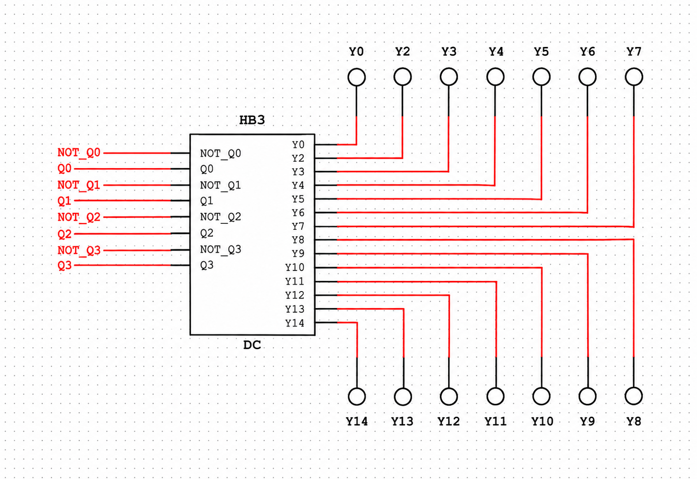
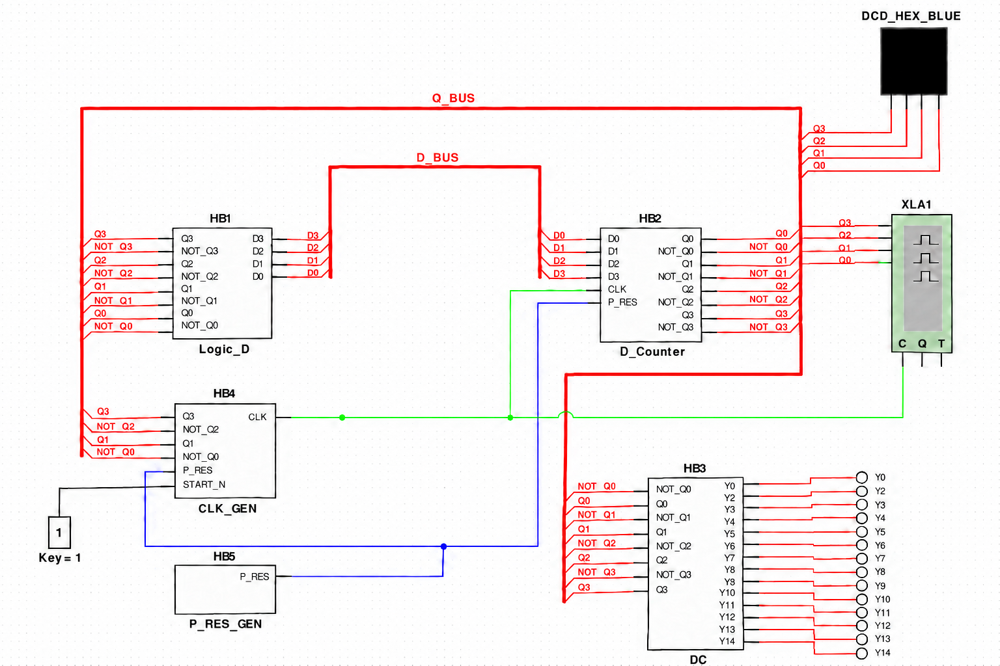

# Подключение DC и общая схема

Сохранённый ответ от 25 сентября 2026 года. Для просмотра текста вместе с картинками в браузере откройте `Открыть_памятку.html`. Вся папка переносится на другой ПК целиком, интернет не нужен.

На фото написано **DC1 — дешифратор**. У тебя он уже собран и называется **HB3 / DC**. Кружки вокруг — индикаторы `probes`, такие же, как у тебя над счётчиком.

Для твоего варианта:

- Слева DC подключи к одноимённым выходам `Q0…Q3` и `NOT_Q0…NOT_Q3` счётчика.
- Справа поставь **14 отдельных индикаторов**: `Y0`, `Y2`…`Y14`. Можешь копировать уже имеющийся probe.
- Например, при коде `D` должен гореть `Y13`, при коде `6` — `Y6`.

Переделал оформление по твоему скриншоту. Используй эти **финальные версии** — в промежуточных картинках в чате были ошибки проводки:

## DC крупно — куда подключить индикаторы

## Общая схема — итоговый вид

На общей схеме **зелёный — CLK, синий — P_RES, чёрный от переключателя — START_N**. Красные толстые линии — шины: каждый сигнал подключай отдельным именованным отводом.

Картинки созданы через ImageGen по твоим снимкам; это иллюстрации подключения, не настоящие скриншоты работающей модели.
